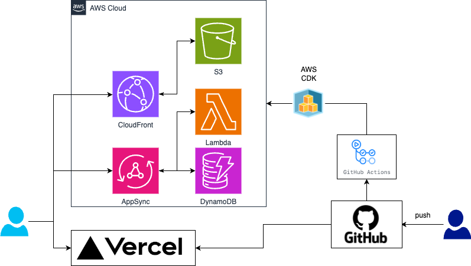

# MAAAASHI'S CHAT

<div></div>

<div align="center">
  This system is a chat application created with Next.js and AWS AppSync. A Google or Github account is required for use.
</div>

- [MAAAASHI'S CHAT](#maaaashis-chat)
- [Installation](#installation)
- [Usage](#usage)
- [アーキテクチャ図](#アーキテクチャ図)
- [DB 設計](#db-設計)

# Installation

```bash
$ git clone https://github.com/maaaashi/maaaashi-chat
$ cd maaaashi-chat
```

# Usage

```bash
$ make dev
```

Access to http://localhost:3000

# アーキテクチャ図

<div></div>

# DB 設計

`./docs/DynamoDB設計書.md`参照

<!-- # Test

```bash
# Run test
$ npm run test:watch
``` -->
